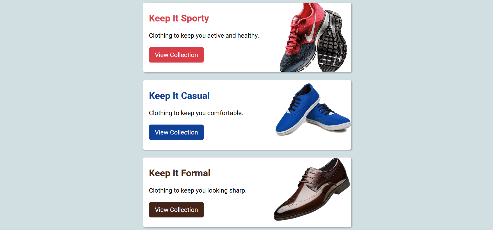

# Simple Cards Projects

A basic HTML and CSS project featuring three cards with title, description, button, and background image.

## Technologies Used

- HTML
- CSS

## Inspiration and Learning

Lumina Creative was created as a project for the "Modern HTML & CSS from the Beginning (2024 Revamp)" course by Brad Traversy.

## Notes

This project was created as part of an introductory HTML and CSS course, prior to learning Flexbox and Grid. As such, the layout uses basic CSS styling and background images instead of more advanced layout techniques.
